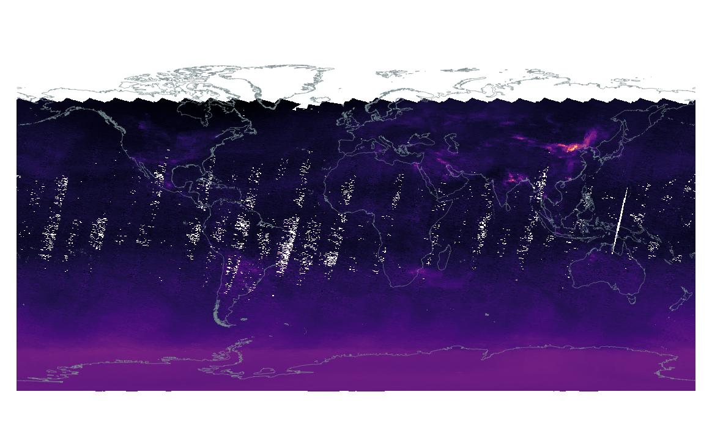

## GOME-2 to Image

Rasterize MetOp A/B/C GOME-2 data into GeoTiff images.



The [Global Ozone Monitoring Experiment-2 (GOME-2)](https://www.eumetsat.int/gome-2) is an instrument aboard the [MetOp](https://www.eumetsat.int/our-satellites/metop-series) series of satellites. The MetOp satellites are a group of polar-orbiting meteorological satellites launched and operated by the European Organisation for the Exploitation of Meteorological Satellites (EUMETSAT).

### Requirements

All requirements are listed in the `requirements.txt`.

### Usage

To generate a GeoTiff image from a netCDF4 file, use:

```bash
python gome2-to-image.py file.HDF5 -p NO2 --scale 15
```

Where `-p` is the product to export (NO2, O3, etc.), and `--scale` is the factor used to downscale the data during export.

To generate an image from a list of netCDF4 files, such as creating a filled globe with GOME-2 stripes for a specific day, simply provide the directory containing all the files using the following input:

```bash
python gome2-to-image.py data/20220105 -p NO2 --scale 15
```

When combining multiple stripes, if there are overlapping pixels the average is used.

### Error values

Note, every value that is negative or where the error percentage is greater than `error-threshold` is removed from the final GeoTiff (fill value is -1). See all available options using the `-h` argument.

### Available products

The scripts works for the following products:

| Product  | Name                           | Unit          | Recommended scale |
| -------- | ------------------------------ | ------------- | ----------------- |
| O3       | Ozone                          | Dobson units  | 1                 |
| NO2      | Nitrogen dioxide               | Molecules/cm² | 15                |
| NO2Tropo | Nitrogen dioxide (troposphere) | Molecules/cm² | 15                |
| BrO      | Bromine monoxide               | Molecules/cm² | 13                |
| SO2      | Sulfur dioxide                 | Dobson units  | 1                 |
| H2O      | Water vapor                    | Kg/m²         | 1                 |
| HCHO     | Formaldehyde                   | Molecules/cm² | 15                |

It is possible to explore GOME-2 data using the [ATMOS web application](https://atmos.eoc.dlr.de/app/calendar).

### Disclamer

The script has not been tested strictly for every possible product. We recommend to always check the output for correctness. I do not take responsibility for erroneous values. Feel free to open an issue if something is wrong.